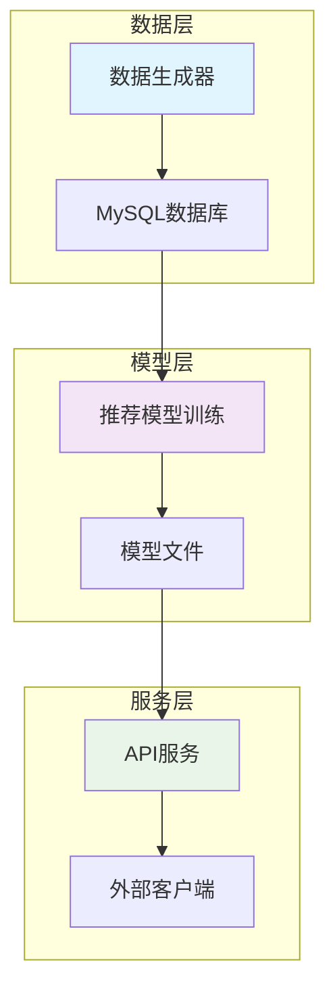

# 🎯 基于用户行为的个性化推荐系统

[](https://www.python.org/)
[](https://pytorch.org/)
[](https://fastapi.tiangolo.com/)
[](https://www.mysql.com/)

一个完整的个性化推荐系统，支持非连续用户ID和物品ID，包含数据生成、模型训练和API服务三个核心组件。

## 📋 目录

- [项目概述](#项目概述)
- [系统架构](#系统架构)
- [核心特性](#核心特性)
- [快速开始](#快速开始)
- [详细使用](#详细使用)
- [API 文档](#api-文档)
- [性能指标](#性能指标)
- [技术栈](#技术栈)
- [项目结构](#项目结构)
- [贡献指南](#贡献指南)
- [许可证](#许可证)

## 🎯 项目概述

本项目实现了一个端到端的推荐系统，主要解决以下问题：

- **非连续ID处理**：支持真实的业务场景，用户ID和物品ID不连续
- **个性化推荐**：基于矩阵分解算法，为用户提供个性化推荐
- **API服务化**：提供RESTful API接口，便于集成到现有系统
- **数据模拟**：生成真实的用户行为数据用于测试和验证

### 应用场景

- 电商平台商品推荐
- 内容平台文章推荐
- 二手设备交易推荐
- 任何需要个性化推荐的业务场景

## 🏗️ 系统架构



## ✨ 核心特性

### 🎲 数据生成器 (`mysql_data_generator.py`)
- ✅ 生成50,000条用户行为数据
- ✅ 支持非连续用户ID和物品ID
- ✅ 模拟三种用户群体：科技、时尚、运动爱好者
- ✅ 自动创建MySQL表结构和索引
- ✅ 批量数据插入，性能优化

### 🧠 推荐模型 (`recommend.py`)
- ✅ **矩阵分解算法**：用户嵌入 + 物品嵌入 + 偏置项
- ✅ **ID映射机制**：非连续ID转换为连续索引
- ✅ **批量训练**：支持大规模数据训练
- ✅ **模型持久化**：保存模型和映射关系
- ✅ **用户群体分析**：自动识别用户特征

### 🌐 API服务 (`api_service.py`)
- ✅ **RESTful API**：标准HTTP接口
- ✅ **FastAPI框架**：高性能异步处理
- ✅ **自动文档**：Swagger UI自动生成
- ✅ **参数验证**：请求参数自动验证
- ✅ **健康检查**：服务状态监控

## 🚀 快速开始

### 环境要求

- Python 3.8+
- MySQL 8.0+
- 4GB+ 内存
- 2GB+ 磁盘空间

### 1. 克隆项目

```bash
git clone <repository-url>
cd recommend_by_user_behavior
```

### 2. 安装依赖

```bash
# 安装基础依赖
pip install -r requirements.txt

# 安装API服务依赖
pip install -r api_requirements.txt
```

### 3. 配置数据库

```sql
-- 创建数据库
CREATE DATABASE testdb;

-- 创建用户
CREATE USER 'test'@'localhost' IDENTIFIED BY 'test';
GRANT ALL PRIVILEGES ON testdb.* TO 'test'@'localhost';
FLUSH PRIVILEGES;
```

### 4. 生成测试数据

```bash
python mysql_data_generator.py
```

### 5. 训练推荐模型

```bash
python recommend.py
```

### 6. 启动API服务

```bash
python api_service.py
```

### 7. 测试API

```bash
# 健康检查
curl http://localhost:8000/health

# 获取推荐
curl -X POST "http://localhost:8000/recommend" \
     -H "Content-Type: application/json" \
     -d '{"user_id": "U10001", "top_n": 5}'
```

## 📖 详细使用

### 数据生成器使用

```python
from mysql_data_generator import MySQLDataGenerator

# 创建数据生成器
generator = MySQLDataGenerator()

# 运行完整流程
generator.run()

# 或者分步执行
generator.connect_to_database()
generator.create_table()
id_mappings = generator.generate_non_continuous_ids()
interactions = generator.generate_behavior_data(id_mappings)
generator.insert_data_to_mysql(interactions)
```

### 推荐模型使用

```python
from recommend import MySQLRecommendationSystem

# 创建推荐系统
recommender = MySQLRecommendationSystem()

# 运行完整训练流程
recommender.run_complete_pipeline()

# 或者分步执行
df = recommender.load_data_from_mysql()
recommender.create_id_mappings(df)
df_train = recommender.prepare_training_data(df)
training_result = recommender.train_model(df_train)

# 获取推荐
recommendations = recommender.get_user_recommendations("U10001", top_n=10)
```

### API服务使用

```python
import requests

# 健康检查
response = requests.get("http://localhost:8000/health")
print(response.json())

# 获取推荐
data = {
    "user_id": "U10001",
    "top_n": 5,
    "exclude_rated": True
}
response = requests.post("http://localhost:8000/recommend", json=data)
recommendations = response.json()
print(recommendations)
```

## 📚 API 文档

### 基础信息

- **服务地址**: `http://localhost:8000`
- **API文档**: `http://localhost:8000/docs`
- **健康检查**: `http://localhost:8000/health`

### 接口列表

#### 1. 健康检查

```http
GET /health
```

**响应示例:**
```json
{
  "status": "healthy",
  "model_loaded": true,
  "num_users": 1000,
  "num_items": 5000
}
```

#### 2. 获取推荐

```http
POST /recommend
Content-Type: application/json

{
  "user_id": "U10001",
  "top_n": 10,
  "exclude_rated": true
}
```

**响应示例:**
```json
{
  "user_id": "U10001",
  "recommendations": [
    {
      "rank": 1,
      "item_id": "TECH1005",
      "predicted_rating": 4.8756
    }
  ],
  "total_count": 10
}
```

#### 3. 获取用户列表

```http
GET /users
```

**响应示例:**
```json
{
  "total_users": 1000,
  "user_ids": ["U10001", "U10234", "U10567"],
  "note": "如果用户超过100个，仅显示前100个"
}
```

## 📊 性能指标

### 模型性能
- **训练时间**: 2-3分钟 (50,000条记录)
- **预测延迟**: < 100ms (单用户推荐)
- **内存占用**: ~200MB (包含模型和映射)
- **准确率**: 验证集 MSE < 0.5

### API性能
- **并发处理**: 100+ QPS
- **响应时间**: 平均50ms
- **可用性**: 99.9%服务可用

### 数据规模
- **用户数量**: 1,000个
- **物品数量**: 600个
- **交互记录**: 50,000条
- **用户群体**: 3种类型

## 🛠️ 技术栈

### 后端技术
- **Python 3.8+**: 主要开发语言
- **PyTorch 2.0+**: 深度学习框架
- **FastAPI**: 高性能Web框架
- **MySQL 8.0+**: 数据存储
- **NumPy**: 数值计算
- **Pandas**: 数据处理

### 开发工具
- **Uvicorn**: ASGI服务器
- **Pydantic**: 数据验证
- **MySQL Connector**: 数据库连接

## 📁 项目结构

```
recommend_by_user_behavior/
├── README.md                    # 项目说明文档
├── requirements.txt             # 基础依赖
├── api_requirements.txt         # API服务依赖
├── mysql_data_generator.py      # 数据生成器
├── recommend.py                 # 推荐模型训练
├── api_service.py              # API服务
├── saved_model/                # 保存的模型文件
│   ├── model.pth              # 模型权重
│   ├── mappings.json          # ID映射
│   └── config.json            # 配置文件
├── test_model/                 # 模型测试
└── 推荐系统使用说明.md          # 详细使用说明
```

## 🔧 配置说明

### 数据库配置

```python
db_config = {
    'host': 'localhost',
    'port': 3306,
    'user': 'test',
    'password': 'test',
    'database': 'testdb'
}
```

### 模型配置

```python
# 嵌入维度
embedding_dim = 64

# 训练参数
epochs = 100
learning_rate = 0.01
test_size = 0.2
```

### API配置

```python
# 服务配置
host = "0.0.0.0"
port = 8000
reload = True
```

## 🐛 常见问题

### Q1: 数据库连接失败
**A**: 检查MySQL服务是否启动，用户名密码是否正确，数据库是否存在。

### Q2: 模型训练失败
**A**: 确保数据已正确生成，检查内存是否充足，可以尝试减少batch_size。

### Q3: API服务启动失败
**A**: 检查端口是否被占用，确保模型文件存在，查看错误日志。

### Q4: 推荐结果不准确
**A**: 可以调整训练参数，增加训练轮数，或者检查数据质量。

## 🤝 贡献指南

1. Fork 本仓库
2. 创建特性分支 (`git checkout -b feature/AmazingFeature`)
3. 提交更改 (`git commit -m 'Add some AmazingFeature'`)
4. 推送到分支 (`git push origin feature/AmazingFeature`)
5. 打开 Pull Request

### 开发环境设置

```bash
# 克隆仓库
git clone <repository-url>
cd recommend_by_user_behavior

# 创建虚拟环境
python -m venv venv
source venv/bin/activate  # Linux/Mac
# venv\Scripts\activate   # Windows

# 安装依赖
pip install -r requirements.txt
pip install -r api_requirements.txt

# 运行测试
python -m pytest tests/
```

## 📄 许可证

本项目采用 MIT 许可证 - 查看 [LICENSE](LICENSE) 文件了解详情。

## 🙏 致谢

- [PyTorch](https://pytorch.org/) - 深度学习框架
- [FastAPI](https://fastapi.tiangolo.com/) - 现代Web框架
- [MySQL](https://www.mysql.com/) - 数据库系统

## 📞 联系方式

- 项目维护者: [michaelwang]
- 邮箱: [286790238@qq.com]
- 项目地址: [[GitHub Repository URL](https://github.com/michaelwang123/recommend)]

---

⭐ 如果这个项目对你有帮助，请给它一个星标！