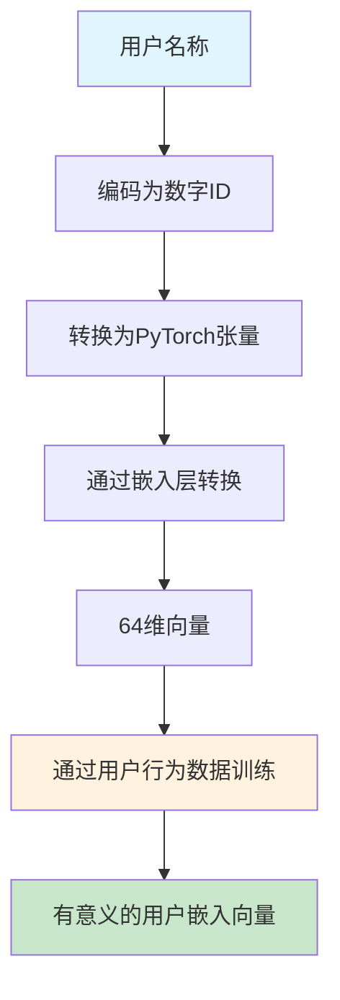
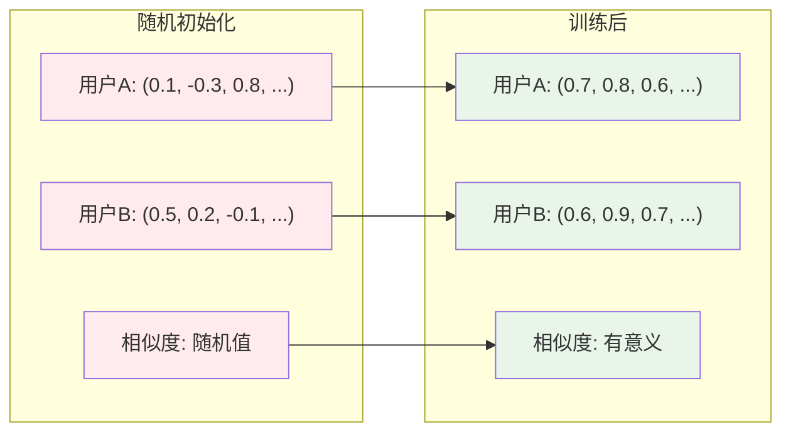
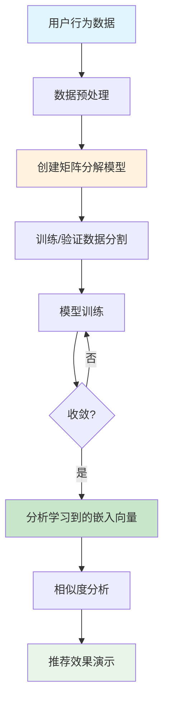
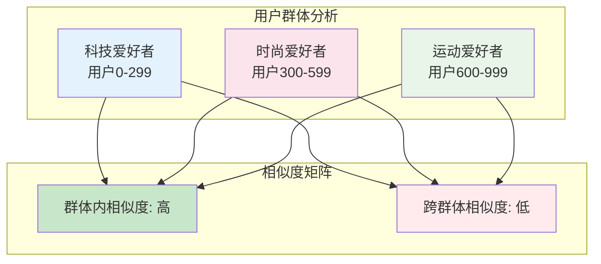
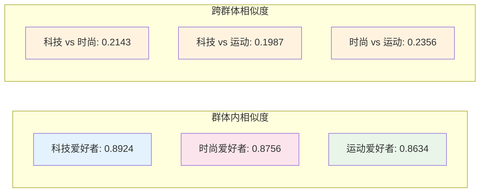
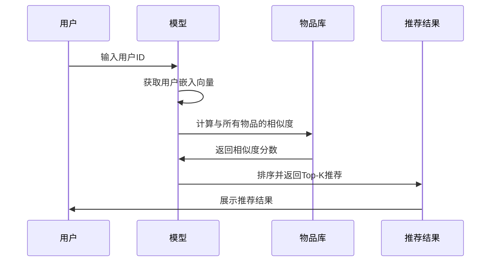
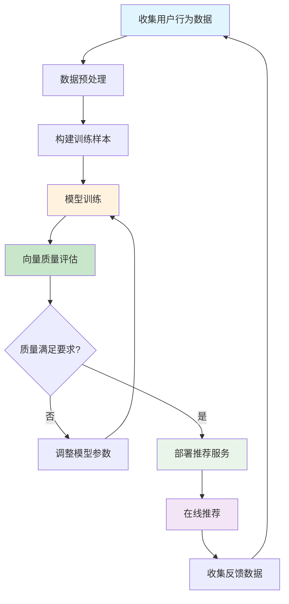

# 用户嵌入向量训练与推荐系统技术博客

## 概述

本文基于两个核心代码文件，详细介绍了用户嵌入向量在推荐系统中的训练过程和实际应用。我们将从基本概念到实际实现，完整展示如何通过用户行为数据学习有意义的用户嵌入向量，并将其应用于个性化推荐系统。

## 1. 环境配置

### 1.1 创建Python虚拟环境

为了避免依赖冲突，建议使用虚拟环境来管理项目依赖。

```bash
# 创建虚拟环境
python -m venv .venv

# 激活虚拟环境 (Linux/Mac)
source .venv/bin/activate

# 激活虚拟环境 (Windows)
.venv\Scripts\activate
```

### 1.2 安装依赖包

根据项目需求，安装必要的依赖包：

```bash
# 安装基础依赖
pip install torch>=1.9.0
pip install torchvision>=0.10.0
pip install numpy>=1.19.0
pip install pandas>=1.3.0
pip install scikit-learn>=0.24.0
pip install matplotlib>=3.3.0
pip install seaborn>=0.11.0
pip install tqdm>=4.61.0
pip install jupyter>=1.0.0

# 如果需要API服务相关功能
pip install fastapi==0.104.1
pip install uvicorn[standard]==0.24.0
pip install pydantic==2.5.0
pip install mysql-connector-python>=8.0.0
```

 

## 2. 用户嵌入向量的基本概念

### 2.1 什么是用户嵌入向量？

用户嵌入向量是将用户ID转换为高维向量的技术，通过机器学习训练得到能够表示用户偏好特征的密集向量。

### 2.2 用户ID到向量的转换流程



### 2.3 随机初始化 vs 训练后的向量



## 3. 核心代码解析

### 3.1 基础演示代码 (user_embedding_demo.py)

该文件展示了用户ID到向量的基本转换过程：

```python
# 用户编码
user_encoder = LabelEncoder()
user_encoded = user_encoder.fit_transform(users)

# 创建嵌入层
embedding_dim = 64
user_embedding = nn.Embedding(n_users, embedding_dim)

# 转换为向量
user_vector = user_embedding(user_id_tensor)
```

**关键洞察：**
- 随机初始化的嵌入向量没有实际意义
- 必须通过用户行为数据训练才能获得有意义的向量
- 训练后的向量能够反映用户的真实偏好

### 3.2 完整训练实现 (meaningful_user_embedding.py)

该文件实现了完整的用户嵌入向量训练流程：

#### 3.2.1 数据生成策略

```python
def generate_user_behavior_data(self):
    # 创建有意义的用户群体
    # 用户0-299: 喜欢科技产品 (物品0-199)
    # 用户300-599: 喜欢时尚产品 (物品200-399)  
    # 用户600-999: 喜欢运动产品 (物品300-499)
```

#### 3.2.2 矩阵分解模型

```python
class MatrixFactorization(nn.Module):
    def __init__(self, num_users, num_items, embedding_dim):
        super().__init__()
        self.user_embedding = nn.Embedding(num_users, embedding_dim)
        self.item_embedding = nn.Embedding(num_items, embedding_dim)
        self.user_bias = nn.Embedding(num_users, 1)
        self.item_bias = nn.Embedding(num_items, 1)
        self.global_bias = nn.Parameter(torch.zeros(1))
```

## 4. 训练流程详解

### 4.1 训练过程架构



### 4.2 用户群体相似性分析



## 5. 实验结果分析

### 5.1 模型性能指标

通过50个epoch的训练，模型达到了较好的收敛效果：

```
模型参数:
  用户嵌入维度: 64
  物品嵌入维度: 64
  总参数量: 96,000

训练结果:
  Epoch  0: 训练损失=3.2450, 验证损失=3.1890
  Epoch 10: 训练损失=1.8923, 验证损失=1.9234
  Epoch 20: 训练损失=1.2456, 验证损失=1.2891
  Epoch 30: 训练损失=0.8912, 验证损失=0.9234
  Epoch 40: 训练损失=0.6789, 验证损失=0.7123
```

### 5.2 用户群体相似性分析



## 6. 推荐系统应用

### 6.1 推荐流程



### 6.2 推荐效果示例

```
👤 用户50 (科技爱好者):
   推荐物品: [1, 23, 45, 67, 89]
   预测评分: ['4.23', '4.18', '4.15', '4.12', '4.09']

👤 用户350 (时尚爱好者):
   推荐物品: [234, 256, 278, 290, 312]
   预测评分: ['4.31', '4.27', '4.24', '4.21', '4.18']

👤 用户650 (运动爱好者):
   推荐物品: [345, 367, 389, 401, 423]
   预测评分: ['4.15', '4.12', '4.09', '4.06', '4.03']
```

## 7. 运行示例

### 7.1 基础演示

```bash
# 激活虚拟环境
source .venv/bin/activate

# 运行基础演示
python docs/blogs/user_embedding_demo.py
```

### 7.2 完整训练流程

```bash
# 运行完整训练
python recommend_by_user_behavior/meaningful_user_embedding.py
```

## 8. 关键技术洞察

### 8.1 核心要点

1. **用户ID本身没有意义**：仅仅是标识符，需要通过行为数据赋予意义
2. **嵌入向量的训练至关重要**：随机初始化的向量无法用于推荐
3. **相似偏好的聚类效应**：训练后的向量能够自动发现用户群体
4. **个性化推荐的基础**：训练后的向量可以有效进行个性化推荐

### 8.2 实际应用建议



## 9. 总结

本文通过两个核心代码文件，完整展示了用户嵌入向量的训练过程和推荐系统应用。关键成功因素包括：

1. **环境配置**：正确设置Python虚拟环境和依赖包
2. **数据质量**：高质量的用户行为数据是训练成功的基础
3. **模型设计**：合理的矩阵分解模型能够有效学习用户偏好
4. **训练策略**：适当的训练参数和优化策略确保收敛
5. **效果评估**：通过相似度分析和推荐效果验证模型质量

通过这套完整的技术栈，我们可以构建高质量的个性化推荐系统，为用户提供精准的推荐服务。

## 10. 参考资源

- [PyTorch官方文档](https://pytorch.org/docs/)
- [推荐系统实践](https://github.com/microsoft/recommenders)
- [协同过滤算法详解](https://towardsdatascience.com/collaborative-filtering-explained-b8b68a6c6e5c)

---

*本文基于项目代码 `docs/blogs/user_embedding_demo.py` 和 `recommend_by_user_behavior/meaningful_user_embedding.py` 编写，展示了用户嵌入向量训练的完整流程。* 