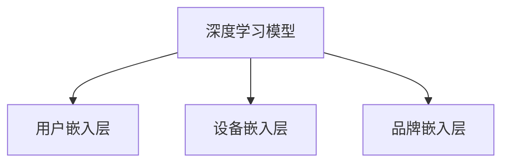

我来为您详细讲解这段**推荐系统训练代码**，这是二手设备推荐平台的核心训练逻辑。

## 🎯 代码功能概述

这段代码是`SecondHandRecommendationSystem`类的`train`方法，负责训练深度学习推荐模型。它将原始的用户、设备和交互数据转换为可训练的格式，并构建神经网络模型。

## 📋 代码逐行解析

```python
def train(self, user_data, device_data, interaction_data, epochs=30):
    """训练推荐系统"""
    logger.info("开始训练推荐系统...")
```
**方法签名**：
- `user_data`: 用户基础信息（用户ID、年龄、城市等）
- `device_data`: 设备信息（设备ID、品牌、价格、配置等）
- `interaction_data`: 用户-设备交互记录（用户ID、设备ID、评分、时间戳等）
- `epochs`: 训练轮数，默认30轮

### 🔄 **第1步：数据合并**
```python
# 合并数据
merged_data = interaction_data.merge(device_data, on='device_id', how='left')
```
**作用**：将交互数据与设备数据按`device_id`进行左连接
**结果**：获得包含交互信息 + 设备详细信息的完整数据集

**示例数据合并前后**：
```python
# 交互数据
interaction_data: [user_id, device_id, rating, timestamp]
device_data: [device_id, brand, category, price]

# 合并后
merged_data: [user_id, device_id, rating, timestamp, brand, category, price]
```

### 🏷️ **第2步：特征编码**
```python
# 编码特征
merged_data['user_encoded'] = self.user_encoder.fit_transform(merged_data['user_id'])
merged_data['device_encoded'] = self.device_encoder.fit_transform(merged_data['device_id'])
merged_data['brand_encoded'] = self.brand_encoder.fit_transform(merged_data['brand'])
```

**作用**：将类别型特征转换为数值型特征，因为深度学习模型只能处理数值数据

**LabelEncoder转换示例**：
```python
# 原始数据
user_id: [1, 5, 8, 12] → user_encoded: [0, 1, 2, 3]
device_id: [101, 205, 88] → device_encoded: [0, 1, 2] 
brand: ['苹果', '华为', '小米'] → brand_encoded: [0, 1, 2]
```

### 🧠 **第3步：模型构建**
```python
# 创建模型
n_users = len(self.user_encoder.classes_)
n_devices = len(self.device_encoder.classes_)
n_brands = len(self.brand_encoder.classes_)

self.model = SecondHandDeviceRecommender(n_users, n_devices, n_brands)
```

**作用**：
1. **计算唯一值数量**：确定嵌入层的输入维度
2. **创建神经网络模型**：构建深度学习推荐模型

**模型架构对应关系**：
```python
n_users = 100   → 用户嵌入层: Embedding(100, 64)
n_devices = 50  → 设备嵌入层: Embedding(50, 64)  
n_brands = 5    → 品牌嵌入层: Embedding(5, 64)
```

### 🚀 **第4步：模型训练**
```python
# 训练模型
self._train_model(merged_data, epochs)
self.is_trained = True

logger.info("训练完成!")
```

**作用**：
1. **调用训练方法**：执行实际的模型训练过程
2. **设置训练标志**：标记模型已完成训练
3. **记录日志**：输出训练完成信息

## 🔗 与系统架构的关系

结合您提供的系统架构图，这个训练方法对应图中的**深度学习模型**部分：



**对应关系**：
- `n_users` → **用户嵌入层**的输入维度
- `n_devices` → **设备嵌入层**的输入维度  
- `n_brands` → **品牌嵌入层**的输入维度

## 💡 代码设计亮点

### 1. **数据预处理自动化**
- 自动合并多表数据
- 自动编码类别特征
- 无需手动处理数据格式

### 2. **动态模型构建**
- 根据数据自动计算模型参数
- 支持不同规模的数据集
- 灵活适应数据变化

### 3. **状态管理**
- `is_trained`标志防止重复训练
- `self.user_encoder`等编码器保存，用于预测时解码

### 4. **日志记录**
- 详细的训练过程日志
- 便于调试和监控

## 🔄 训练流程示意

```python
原始数据 → 数据合并 → 特征编码 → 模型构建 → 神经网络训练 → 模型就绪
   ↓           ↓          ↓          ↓           ↓           ↓
用户/设备   interaction  数值化     动态架构    梯度下降    可用于推荐
交互数据    + device     特征       构建        优化        
```

## 🎯 实际应用示例

```python
# 使用示例
recommender = SecondHandRecommendationSystem()

# 准备数据
users = pd.DataFrame({...})      # 用户数据
devices = pd.DataFrame({...})    # 设备数据  
interactions = pd.DataFrame({...}) # 交互数据

# 训练模型
recommender.train(users, devices, interactions, epochs=20)

# 现在可以进行推荐
recommendations = recommender.recommend_for_user(user_id=1, k=5)
```

这个训练方法是整个推荐系统的**核心入口**，它将原始业务数据转换为可训练的深度学习模型，为后续的个性化推荐、相似设备推荐等功能提供基础。