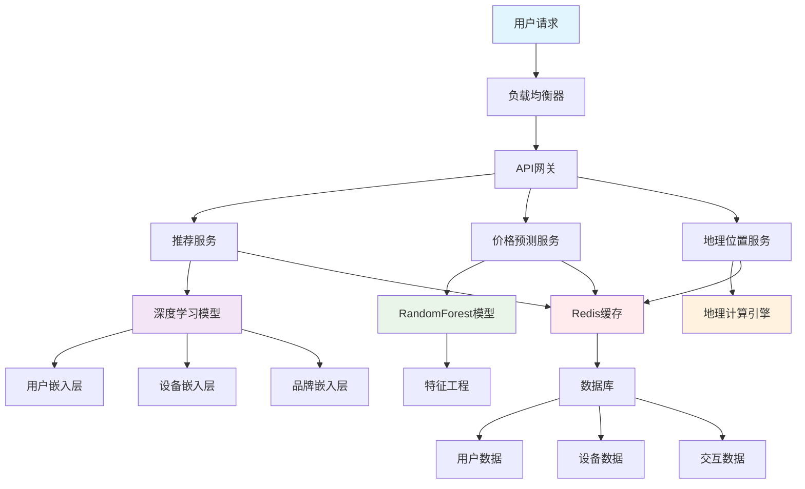
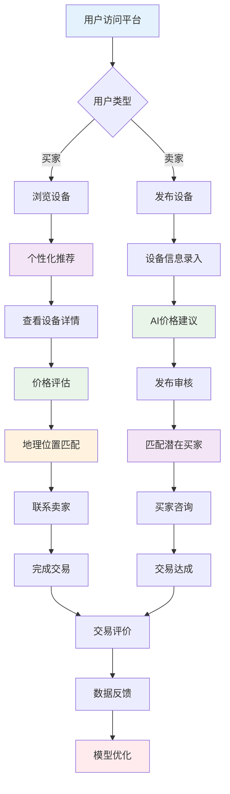
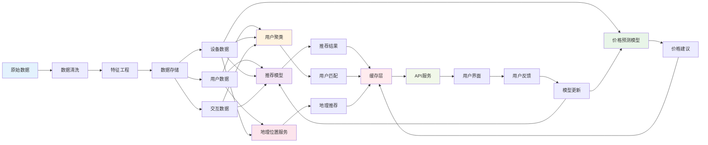

# 二手设备推荐平台：AI驱动的智能交易生态系统

## 🎯 项目概述

随着数字化时代的到来，二手设备交易市场正在经历前所未有的增长。从智能手机到笔记本电脑，从平板到智能手表，消费者对二手设备的需求日益增长。然而，传统的二手交易平台面临着信息不对称、价格不透明、匹配效率低等诸多挑战。

为了解决这些痛点，我们开发了一套基于人工智能的**二手设备推荐平台**，利用深度学习技术为用户提供个性化推荐、智能价格预测、地理位置匹配等创新服务，旨在打造一个高效、透明、智能的二手设备交易生态系统。

## 📊 需求分析

### 用户痛点
1. **信息不对称**：买家难以准确评估设备价值
2. **价格不透明**：缺乏科学的价格评估体系
3. **匹配效率低**：传统搜索方式难以精准匹配需求
4. **交易风险高**：缺乏可靠的信任机制
5. **地理限制**：忽略地理位置因素导致交易成本高

## 🚀 技术方案总览

我们的二手设备推荐平台采用了**"AI + 大数据"**的核心技术架构，通过深度学习算法实现智能推荐，为二手设备交易提供全方位的技术支持。

### 核心技术栈
- **深度学习框架**：PyTorch
- **推荐算法**：协同过滤 + 深度神经网络
- **机器学习**：RandomForest价格预测
- **后端服务**：Flask + Redis缓存
- **部署方案**：Docker容器化
- **数据处理**：Pandas + NumPy

## 🏗️ 系统架构设计

我们的系统采用微服务架构，确保高可用性和可扩展性。下图展示了完整的系统架构：

**架构层次说明：**
- **前端层**：用户交互界面
- **网关层**：API网关负责路由和认证
- **服务层**：推荐、价格预测、地理位置等核心服务
- **模型层**：深度学习和机器学习模型
- **缓存层**：Redis提供高速数据访问
- **数据层**：存储用户、设备、交互数据

## 💡 核心功能模块

### 1. 个性化推荐系统

基于深度学习的推荐引擎，通过分析用户行为、设备特征、交互历史等多维度数据，为每位用户提供个性化的设备推荐。

**技术特点：**
- 用户嵌入向量学习用户偏好
- 设备嵌入向量捕捉设备特征
- 深度神经网络融合多维信息
- 实时更新推荐结果

### 2. 智能价格预测

采用RandomForest算法，结合设备品牌、型号、使用年限、成色等因素，为二手设备提供科学的价格评估。

**核心优势：**
- 多因子价格模型
- 市场价格波动分析
- 动态价格区间建议
- 历史价格趋势预测

### 3. 地理位置智能匹配

基于地理信息系统(GIS)技术，为用户推荐附近的二手设备，降低交易成本，提升用户体验。

**功能亮点：**
- 精确距离计算
- 可配置搜索半径
- 区域热度分析
- 物流成本优化

### 4. 买家卖家智能匹配

通过用户聚类算法，分析用户的购买偏好和消费行为，为卖家推荐潜在买家，提高交易成功率。

**匹配维度：**
- 价格敏感度分析
- 品牌偏好匹配
- 购买力评估
- 交易历史分析

## 🔄 业务流程设计

下图展示了完整的用户交易流程，从用户访问到交易完成的全链路设计：

### 买家流程
1. **个性化推荐**：基于用户偏好展示相关设备
2. **智能筛选**：价格、地理位置、品牌等多维度筛选
3. **详情查看**：设备详细信息和AI价格评估
4. **交易决策**：多方信息辅助决策

### 卖家流程
1. **设备发布**：简单快捷的设备信息录入
2. **价格建议**：AI提供科学的价格建议
3. **买家匹配**：系统主动推荐潜在买家
4. **交易管理**：订单跟踪和客户服务
 

## 📊 数据流程与处理

下图展示了从原始数据到用户推荐的完整数据处理流程：

**数据流程关键节点：**
- **数据预处理**：清洗、转换、特征工程
- **模型训练**：深度学习推荐、价格预测、用户聚类
- **实时服务**：缓存优化、API响应、用户界面
- **反馈循环**：用户行为收集、模型持续优化

 

## 📈 项目成果与验证
 
### 功能验证
- **个性化推荐**：为用户推荐符合偏好的设备
- **价格预测**：准确预测设备价格区间
- **地理匹配**：推荐附近设备，降低交易成本
- **智能匹配**：提高买家卖家匹配成功率
 
 
## 💡 总结与展望

二手设备推荐平台是一个**技术驱动、市场导向、用户中心**的创新项目。我们通过人工智能技术解决了传统二手交易的核心痛点，为用户提供了智能、高效、透明的交易体验。

### 核心价值
- **技术创新**：深度学习在推荐系统的成功应用
- **商业价值**：巨大的市场潜力和商业机会
- **社会意义**：促进循环经济和可持续发展
- **用户价值**：提升用户体验和交易效率

### 竞争优势
- **算法领先**：自主研发的推荐算法
- **数据驱动**：基于大数据的精准推荐
- **用户体验**：简单易用的交互设计
- **技术壁垒**：深度学习和大数据技术门槛
