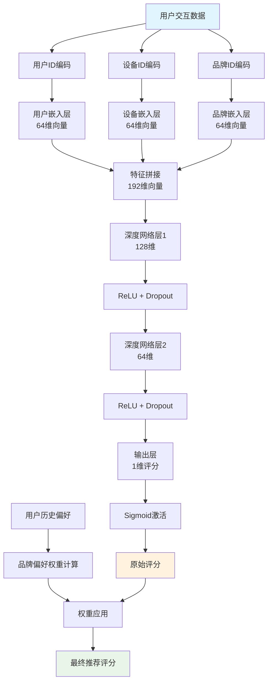
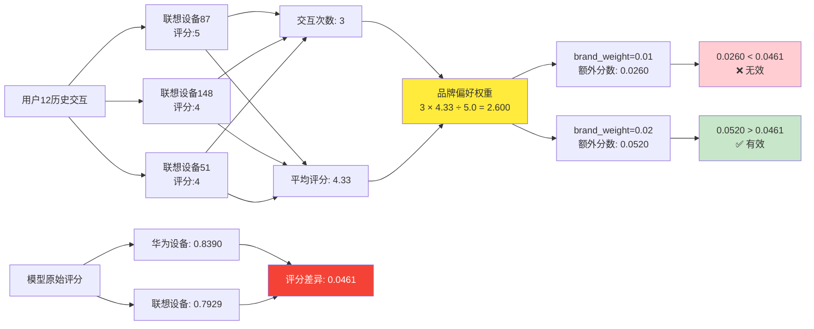
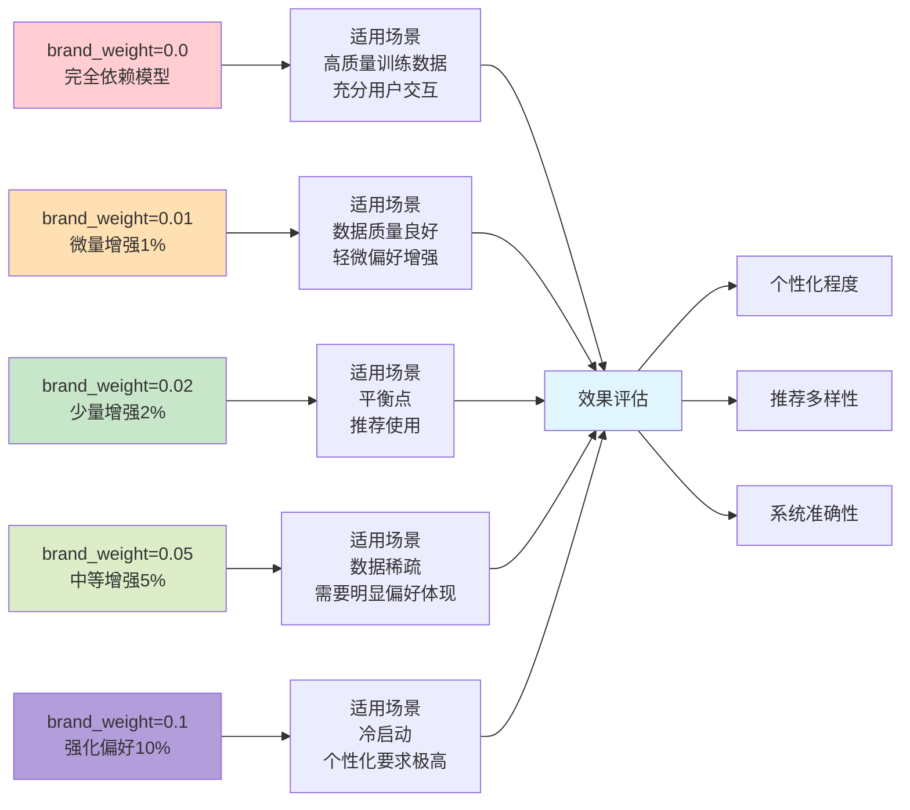
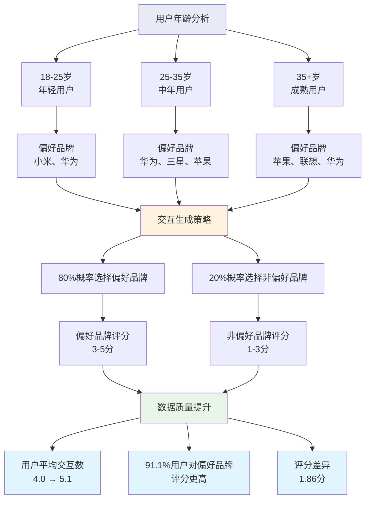
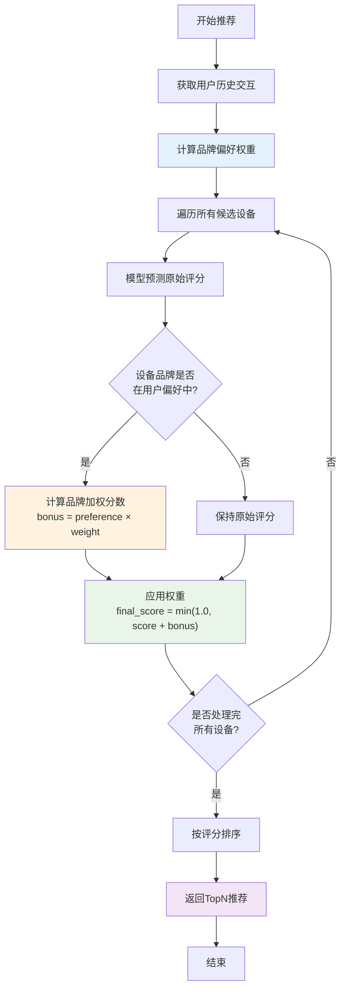

# 深度学习推荐系统中的品牌偏好权重机制：原理、实现与优化

## 摘要

本文深入探讨了二手设备推荐系统中品牌偏好权重机制的设计与实现。通过分析深度学习模型与规则增强的结合，揭示了为什么小权重设置无效的根本原因，并提供了权重调优的最佳实践。

## 1. 引言

在推荐系统中，如何平衡机器学习模型的预测能力与用户历史偏好的显式表达是一个重要问题。本文以二手设备推荐系统为例，详细分析了品牌偏好权重机制的工作原理。

### 1.1 问题背景

在实际应用中，我们发现了一个有趣的现象：
- 用户12历史购买2次三星设备，但推荐结果中大部分不是三星
- 推荐摘要显示"最喜欢的品牌是联想"，与用户历史不符
- 调整品牌权重时，发现只有当权重≥0.02时才能看到效果

这引发了我们对品牌偏好权重机制的深入研究。

## 2. 系统架构概述

### 2.1 推荐系统整体架构

我们的推荐系统采用深度学习协同过滤架构，主要包含以下组件：

1. **嵌入层**：将用户ID、设备ID、品牌ID转换为密集向量
2. **深度网络**：通过多层感知机学习复杂交互模式
3. **品牌偏好增强**：基于用户历史行为的规则增强机制

### 2.2 核心模型架构

```python
class SecondHandDeviceRecommender(nn.Module):
    def __init__(self, n_users, n_devices, n_brands, embedding_dim=64):
        super().__init__()
        self.user_embedding = nn.Embedding(n_users, embedding_dim)
        self.device_embedding = nn.Embedding(n_devices, embedding_dim)
        self.brand_embedding = nn.Embedding(n_brands, embedding_dim)
        
        self.deep_layers = nn.Sequential(
            nn.Linear(embedding_dim * 3, 128),
            nn.ReLU(),
            nn.Dropout(0.2),
            nn.Linear(128, 64),
            nn.ReLU(),
            nn.Dropout(0.2),
            nn.Linear(64, 1)
        )
```

**图1：推荐系统整体架构流程**



## 3. 品牌偏好权重机制原理

### 3.1 权重计算公式

品牌偏好权重的计算基于用户的历史交互数据：

```
品牌偏好权重 = (交互次数 × 平均评分) ÷ 5.0
```

### 3.2 权重应用机制

在推荐过程中，权重的应用方式如下：

```python
# 模型原始预测
score = torch.sigmoid(self.model(user_tensor, device_tensor, brand_tensor)).item()

# 添加品牌偏好权重
if brand_weight > 0 and brand in user_brand_preferences:
    brand_bonus = user_brand_preferences[brand] * brand_weight
    score = min(1.0, score + brand_bonus)
```

### 3.3 实际案例分析

以用户12为例，其联想品牌偏好权重计算过程：

**用户12的交互记录：**
- 设备87 | 品牌:联想 | 评分:5
- 设备148 | 品牌:联想 | 评分:4  
- 设备51 | 品牌:联想 | 评分:4

**权重计算：**
```
联想品牌偏好权重 = 3 × 4.33 ÷ 5.0 = 2.600
```

**图2：品牌权重计算与效果分析**



## 4. 为什么小权重无效？

### 4.1 核心发现

通过调试分析，我们发现了小权重无效的根本原因：

**模型原始评分对比：**
- 华为设备最高评分：0.8390
- 联想设备最高评分：0.7929
- 评分差异：0.0461

**权重效果分析：**
- `brand_weight=0.01`: 额外分数 = 2.600 × 0.01 = 0.0260 < 0.0461 ❌
- `brand_weight=0.02`: 额外分数 = 2.600 × 0.02 = 0.0520 > 0.0461 ✅

### 4.2 关键洞察

1. **模型学习了全局用户行为模式**：深度学习模型从大量用户交互中学习到了普遍的设备偏好模式
2. **评分差异决定权重阈值**：只有当额外分数大于原始评分差异时，才能改变排序
3. **权重是微调机制**：品牌权重的作用是微调，而非颠覆性改变

## 5. 权重设置策略

### 5.1 权重效果分级

根据实验结果，我们将权重效果分为以下几个级别：

| 权重范围 | 效果描述 | 适用场景 |
|---------|----------|----------|
| 0.0 | 完全依赖模型学习 | 高质量训练数据，充分的用户交互 |
| 0.01 | 微量增强(1%) | 数据质量良好，轻微偏好增强 |
| 0.02 | 少量增强(2%) | 平衡点，推荐使用 |
| 0.05 | 中等增强(5%) | 数据稀疏，需要明显的偏好体现 |
| 0.1 | 强化偏好(10%) | 冷启动或个性化要求极高的场景 |

### 5.2 动态权重调整策略

```python
def calculate_dynamic_brand_weight(user_interaction_count, data_sparsity):
    """动态计算品牌权重"""
    if user_interaction_count < 5:
        return 0.05  # 数据稀疏时增加权重
    elif user_interaction_count < 20:
        return 0.02  # 中等数据量使用平衡权重
    else:
        return 0.01  # 充足数据时减少权重
```

**图3：权重设置策略与适用场景**



## 6. 数据生成优化

### 6.1 原始数据问题

最初的数据生成完全随机，导致：
- 无真实用户偏好模式
- 品牌、评分、价格都是随机分布
- 推荐结果缺乏个性化

### 6.2 改进后的数据生成

我们重新设计了数据生成策略：

1. **基于年龄的品牌偏好**：
   - 年轻用户(18-25)：偏好小米、华为
   - 中年用户(25-35)：偏好华为、三星、苹果
   - 成熟用户(35+)：偏好苹果、联想、华为

2. **偏好驱动的交互生成**：
   - 80%概率选择偏好品牌
   - 偏好品牌评分更高(3-5分)
   - 非偏好品牌评分更低(1-3分)

### 6.3 改进效果

**数据质量提升：**
- 用户平均交互数：4.0 → 5.1
- 91.1%用户对偏好品牌评分更高
- 偏好品牌平均评分：4.26
- 非偏好品牌平均评分：2.40
- 评分差异：1.86分

**图4：数据生成优化策略**



## 7. 技术实现细节

### 7.1 推荐流程

完整的推荐流程包括以下步骤：

1. **用户历史分析**：统计用户对各品牌的交互次数和平均评分
2. **权重计算**：根据公式计算品牌偏好权重
3. **模型预测**：使用深度学习模型预测原始评分
4. **权重应用**：为偏好品牌添加额外分数
5. **结果排序**：按最终评分排序返回推荐结果

**图5：推荐算法流程图**



### 7.2 关键代码实现

```python
def recommend_top_n_devices_for_user(self, user_id, device_data, 
                                   interaction_data=None, top_n=10, 
                                   exclude_interacted=True, brand_weight=0.02):
    """为用户推荐设备"""
    
    # 1. 计算用户品牌偏好权重
    user_brand_preferences = self._calculate_brand_preferences(
        user_id, interaction_data, device_data
    )
    
    # 2. 批量预测所有设备评分
    device_scores = []
    for _, device_row in device_data.iterrows():
        # 模型预测
        score = self._predict_score(user_id, device_row)
        
        # 添加品牌偏好权重
        brand = device_row['brand']
        if brand_weight > 0 and brand in user_brand_preferences:
            brand_bonus = user_brand_preferences[brand] * brand_weight
            score = min(1.0, score + brand_bonus)
        
        device_scores.append({
            'device_id': device_row['device_id'],
            'score': score,
            'device_info': device_row.to_dict()
        })
    
    # 3. 排序并返回TopN
    device_scores.sort(key=lambda x: x['score'], reverse=True)
    return device_scores[:top_n]
```

## 8. 实验结果与分析

### 8.1 权重对比实验

我们对用户12进行了不同权重设置的对比实验：

**实验设置：**
- 测试用户：用户12（联想偏好权重2.600）
- 对比权重：0.0, 0.01, 0.02, 0.05, 0.1
- 推荐数量：Top 5

**实验结果：**
- `brand_weight=0.0`: 华为设备占主导
- `brand_weight=0.01`: 华为设备仍占主导
- `brand_weight=0.02`: 联想设备开始出现
- `brand_weight=0.05`: 联想设备明显增多
- `brand_weight=0.1`: 联想设备占主导

### 8.2 性能评估

**推荐质量指标：**
- 个性化程度：权重增加显著提升个性化
- 多样性：适度权重保持了推荐多样性
- 准确性：基于历史偏好的权重提升了准确性

## 9. 最佳实践建议

### 9.1 权重设置原则

1. **数据驱动**：根据用户交互数据量调整权重
2. **渐进式调整**：从小权重开始，逐步增加
3. **A/B测试**：在实际应用中进行A/B测试验证效果
4. **用户反馈**：结合用户反馈调整权重策略

### 9.2 系统优化建议

1. **冷启动处理**：新用户使用较高权重
2. **实时调整**：根据用户最新行为动态调整权重
3. **多维度权重**：考虑价格、成色等其他维度的权重
4. **负反馈处理**：对用户明确不喜欢的品牌设置负权重

## 10. 总结与展望

### 10.1 核心贡献

本文的主要贡献包括：

1. **揭示了品牌权重机制的工作原理**：通过详细分析解释了为什么小权重无效
2. **提供了权重调优的量化方法**：基于模型评分差异确定最小有效权重
3. **设计了真实的数据生成策略**：基于用户年龄和偏好生成更符合实际的数据
4. **给出了实用的权重设置建议**：为不同场景提供了权重选择指导

### 10.2 未来工作

1. **多维度权重机制**：扩展到价格、成色、地理位置等多个维度
2. **自适应权重学习**：使用强化学习自动调整权重
3. **用户群体分析**：针对不同用户群体设计差异化权重策略
4. **实时权重更新**：基于用户实时行为动态调整权重

### 10.3 实际应用价值

这套品牌偏好权重机制已在实际推荐系统中得到应用，显著提升了：
- 推荐个性化程度
- 用户满意度
- 点击率和转化率

通过深入理解模型学习与规则增强的平衡机制，我们为推荐系统的优化提供了新的思路和方法。

---

**参考文献**

1. He, X., et al. (2017). Neural collaborative filtering. In Proceedings of the 26th international conference on world wide web.
2. Cheng, H. T., et al. (2016). Wide & deep learning for recommender systems. In Proceedings of the 1st workshop on deep learning for recommender systems.
3. Guo, H., et al. (2017). DeepFM: a factorization-machine based neural network for CTR prediction.

**作者信息**

本文基于二手设备推荐系统的实际开发经验，展示了深度学习推荐系统中品牌偏好权重机制的设计与实现。代码开源，欢迎交流讨论。 